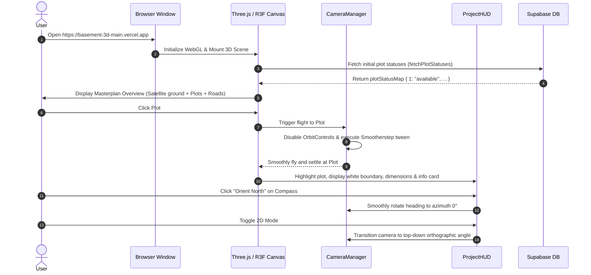

# Project Technical Documentation: 3D Masterplan Interactive Real-Estate Platform

> **Target Audience**: Senior Software Engineers, Technical Architects, 3D Graphics Specialists, Full-Stack Developers.  
> **Source Repository**: `basement-3d-main` (`nnpioneers/basement-3d`)  
> **Document Status**: Complete & Verified against active codebase  
> **Generated Date**: September 2026  

---

## Table of Contents
1. [Project Overview](#1-project-overview)
2. [Complete Technology Stack](#2-complete-technology-stack)
3. [Project Folder / File Structure](#3-project-folder--file-structure)
4. [Application Architecture](#4-application-architecture)
5. [Main Application Entry Flow](#5-main-application-entry-flow)
6. [3D Masterplan System](#6-3d-masterplan-system)
7. [Masterplan / CAD Geometry](#7-masterplan--cad-geometry)
8. [Plot System](#8-plot-system)
9. [Plot Selection and Camera Navigation](#9-plot-selection-and-camera-navigation)
10. [Map System](#10-map-system)
11. [Geographic Masterplan Attachment](#11-geographic-masterplan-attachment)
12. [Map Radius / Geographic Coverage](#12-map-radius--geographic-coverage)
13. [2D / 3D Map Modes](#13-2d--3d-map-modes)
14. [UI / HUD System](#14-ui--hud-system)
15. [Parks, Landscaping & Landmarks](#15-parks-landscaping--landmarks)
16. [Materials and Visual System](#16-materials-and-visual-system)
17. [Performance Optimization](#17-performance-optimization)
18. [State Management](#18-state-management)
19. [Database & Supabase Integration](#19-database--supabase-integration)
20. [Admin Dashboard](#20-admin-dashboard)
21. [Routing](#21-routing)
22. [Environment Variables](#22-environment-variables)
23. [Build Configuration](#23-build-configuration)
24. [Deployment](#24-deployment)
25. [User Interaction Flow](#25-user-interaction-flow)
26. [Important Functions & Components Reference](#26-important-functions--components-reference)
27. [Data Flow Diagrams](#27-data-flow-diagrams)
28. [Known Technical Constraints](#28-known-technical-constraints)
29. [Debugging Guide](#29-debugging-guide)
30. [Development Workflow](#30-development-workflow)
31. [Senior Developer Quick Explanation](#31-senior-developer-quick-explanation)
32. [Glossary](#32-glossary)

---

## 1. Project Overview

### 1.1 What This Project Is
The **3D Masterplan Interactive Real-Estate Platform** is a web-based, GPU-accelerated 3D geospatial visualization application designed for a luxury residential plotted development. It provides prospective buyers, investors, and sales teams with an interactive digital twin of a 201-plot master layout anchored onto real-world high-resolution satellite imagery.

### 1.2 Main Purpose & Business Problem Solved
Traditional plotted real estate projects rely on static 2D PDF brochures, paper blueprints, or disconnected physical models. These media fail to convey:
- True geographic context and real surrounding land development.
- Exact plot dimensions, shape boundaries, frontage, depth, and calculated area ($m^2$ and $ft^2$).
- Spatial orientation relative to true North, entry gates, wide arterial avenues, landscaped public parks, and civic amenities.
- Live real-time plot availability (`available` vs `sold`) synchronized with backend sales databases.

This platform bridges CAD-precision engineering with immersive 3D graphics, delivering instantaneous property exploration directly in any web browser on desktop and mobile without requiring app downloads.

### 1.3 What the User Sees
- **Interactive 3D Scene**: A CAD-accurate layout featuring 201 individual plots, an asphalt/paved road network with lane markings, central roundabout with an architectural clock tower, landscaped corner gardens, entrance security gate with volumetric spotlights, and dual recreational parks (Children's Entrance Park and Main Landmark Park).
- **Satellite Ground Canvas**: High-resolution Google aerial satellite photography seamlessly aligned to the project site, extended by an ~11.3 km wide regional context terrain texture covering a ~6 km radius.
- **Glassmorphic Floating HUD**: Live 3D compass dial orienting to true North, interactive plot search bar, 2D/3D projection switcher, Satellite/Dark blueprint theme toggle, full-screen toggle, project reset view button, and an expandable project metrics modal.
- **Dynamic Plot HUD & Annotations**: Clicking any plot triggers smooth camera flight to that plot, highlighting its boundary with a white outline and corner crosshairs, displaying frontage/depth dimension callouts, area metrics ($m^2$ and $ft^2$), status pill badge, and booking contact CTA.
- **Administrative Portal (`/admin`)**: Secure, authenticated admin dashboard for sales executives to monitor plot inventories and toggle availability statuses with real-time WebSocket sync.

---

## 2. Complete Technology Stack

| Library / Tool | Version | Where Used | Responsibility & Rationale |
| :--- | :--- | :--- | :--- |
| **React** | `^19.2.8` | Core application framework | Component lifecycle, virtual DOM, UI state orchestration, declarative 3D scene composition. |
| **ReactDOM** | `^19.2.8` | DOM entrypoint (`src/main.tsx`) | Mounting the React tree to `document.getElementById('root')`. |
| **TypeScript** | `~6.0.2` | Entire codebase | Static type safety, strict interface contracts for CAD plot specs, database schemas, and 3D vector coordinates. |
| **Vite** | `^8.2.0` | Build tool & local dev server | Instant Hot Module Replacement (HMR), Rollup-based production bundling, optimized dependency pre-bundling (`optimizeDeps`). |
| **Three.js** | `^0.185.1` | 3D Graphics Engine | Core WebGL abstractions: `Scene`, `PerspectiveCamera`, `ExtrudeGeometry`, `MeshStandardMaterial`, `TextureLoader`, `Vector3`, `Matrix4`, raycasting. |
| **@react-three/fiber (R3F)** | `^9.7.0` | 3D React Bridge (`src/components/Scene.tsx`) | Declarative React wrapper around Three.js. Manages render loops (`frameloop="demand"`), canvas resizing, and custom pointer raycasting. |
| **@react-three/drei** | `^10.7.8` | 3D Helpers & Performance | `OrbitControls`, `Text` (SDF 3D typography), `Line` (fat wireframes), `Environment` (IBL lighting), `ContactShadows`, `Bvh` (accelerated raycasting), `PerformanceMonitor`. |
| **@supabase/supabase-js** | `^2.112.3` | Backend Service (`src/services/supabase.ts`) | PostgreSQL database communication, user authentication, and realtime WebSocket change subscriptions (`postgres_changes`). |
| **MapLibre GL** | `^6.9.0` | Core Map Engine dependency | Pre-configured for vector tile mapping operations and geospatial extensions. |
| **Vanilla CSS** | Native | `src/index.css`, `src/App.css` | Glassmorphism, CSS keyframe spinners, floating HUD overlays, responsive media queries. Tailwind is deliberately avoided for total control. |
| **Oxlint** | `^1.75.0` | Linter | High-performance Rust-based JavaScript/TypeScript linting. |
| **Sharp** | `^0.35.3` | Tile & image processing (`scripts/`) | Node.js high-performance image processing for stitching, cropping, and calibrating satellite aerial imagery. |
| **Puppeteer** | `^25.9.0` | Automation (`scripts/`) | Headless browser execution for geospatial visual verification and layout screenshot tests. |

---

## 3. Project Folder / File Structure

```
basement-3d-main/
├── .oxlintrc.json                # Linter configuration
├── .vercel/                      # Vercel deployment configuration cache
├── .vercelignore                 # Excludes heavy scripts, temp folders from deployment
├── index.html                    # HTML shell with mobile viewport-fit and root element
├── package.json                  # NPM dependencies and scripts
├── tsconfig.json                 # Base TypeScript compiler config
├── tsconfig.app.json             # App TypeScript config (DOM, React JSX)
├── tsconfig.node.json            # Node tools TypeScript config
├── vercel.json                   # Vercel SPA routing rewrite configuration
├── vite.config.ts                # Vite build and optimizeDeps configuration
├── public/                       # Static public assets
│   ├── extended_satellite_map.webp  # ~6km radius regional aerial terrain (153/17 scale)
│   ├── satellite_map.webp           # Ultra-high-resolution site-level aerial texture
│   ├── satellite_map.svg            # Fallback SVG ground blueprint
│   ├── favicon.svg                  # SVG browser tab icon
│   ├── icons.svg                    # SVG icon spritesheet
│   └── tiles/                       # Pre-rendered aerial tile bundles
├── src/                          # Application source code
│   ├── main.tsx                  # React 19 root bootstrap
│   ├── App.tsx                   # Top-level router (Scene vs Admin)
│   ├── App.css                   # Global styling
│   ├── index.css                 # Base resets, layout, glassmorphic HUD styling
│   ├── types/
│   │   └── plot.ts               # Type definitions: PlotStatus, PlotBackendData, PlotStatusMap
│   ├── data/
│   │   └── plotLookup.ts         # In-memory spatial index mapping Plot ID -> World Coordinates
│   ├── services/
│   │   └── supabase.ts           # Supabase client, fetch/update mutations, realtime subscription
│   └── components/
│       ├── Scene.tsx             # Master 3D canvas, lighting, BVH, OrbitControls, CameraManager
│       ├── SatelliteGround.tsx   # Dual-layer georeferenced satellite ground plane
│       ├── InteractivePlot.tsx   # Individual extruded plot mesh, labels, dimension lines, click handler
│       ├── RoadNetwork.tsx       # Extruded road surface, punched block holes, chamfers, road text
│       ├── Roundabout.tsx        # Central circular landscaped traffic island
│       ├── ClockTower.tsx        # Classical multi-tiered 3D clock tower landmark
│       ├── EntranceGate.tsx      # Main project portal gate with lighting and spotlights
│       ├── CornerGardens.tsx     # 4 chamfered roundabout pocket gardens with shrubs
│       ├── ParksAndCASite.tsx    # Civic Amenity site, Children's Park, Main Landmark Park
│       ├── ProjectHUD.tsx        # Top-level UI overlays: Compass, Search, Legend, Plot info card
│       ├── AdminDashboardPage.tsx# Sales administration dashboard for managing inventory
│       ├── PlotsLeft.tsx         # Plot cluster component (Plots 1 to 15)
│       ├── PlotsCenterLeft.tsx   # Plot cluster component (Plots 16 to 34)
│       ├── PlotsBlock1Left.tsx   # Plot cluster component (Plots 93 to 103)
│       ├── PlotsBlock1Right.tsx  # Plot cluster component (Plots 104 to 114)
│       ├── PlotsBlock2Left.tsx   # Plot cluster component (Plots 82 to 92)
│       ├── PlotsBlock2Right.tsx  # Plot cluster component (Plots 115 to 125)
│       ├── PlotsBlock3Left.tsx   # Plot cluster component (Plots 71 to 81)
│       ├── PlotsBlock3Right.tsx  # Plot cluster component (Plots 126 to 136)
│       ├── PlotsBlock4Left.tsx   # Plot cluster component (Plots 59 to 70)
│       ├── PlotsBlock4Right.tsx  # Plot cluster component (Plots 137 to 148)
│       ├── PlotsBlock5Right.tsx  # Plot cluster component (Plots 149 to 159)
│       ├── PlotsRightBlock1Left.tsx  # Plot cluster component (Plots 35 to 40)
│       ├── PlotsRightBlock1Right.tsx # Plot cluster component (Plots 41 to 46)
│       ├── PlotsRightBlock2Left.tsx  # Plot cluster component (Plots 47 to 52)
│       ├── PlotsRightBlock2Right.tsx # Plot cluster component (Plots 53 to 58)
│       ├── PlotsRightBlock3Left.tsx  # Plot cluster component (Plots 189 to 194)
│       ├── PlotsRightBlock3Right.tsx # Plot cluster component (Plots 183 to 188)
│       ├── PlotsRightBlock4Left.tsx  # Plot cluster component (Plots 195 to 201)
│       ├── PlotsRightBlock4Right.tsx # Plot cluster component (Plots 177 to 182)
│       └── park/                 # Modular recreational park components
│           ├── config.ts         # Exact spatial coordinates for park zones & amenities
│           ├── Geometry.tsx      # Reusable 3D primitives (BoxPath, arcs, extruded paths)
│           ├── Park.tsx          # Outer walking loop track, inner lawn, central plazas
│           ├── MainPark.tsx      # Composition root for the Main Landmark Park
│           ├── EntrancePark.tsx  # Children's park with playground, swing, slide, see-saw, benches
│           ├── Landscape.tsx     # Tree placement arrays, shrubs, floral borders
│           ├── PlayArea.tsx      # Rubber-floored children's playground structure
│           ├── GymArea.tsx       # Outdoor fitness & calisthenics zone
│           ├── Gazebo.tsx        # Octagonal architectural gazebo pavilion
│           ├── Pergola.tsx       # Timber trellis shade structure
│           ├── RelaxationArea.tsx# Contemplation garden with paved seating
│           ├── CampfireArea.tsx  # Circular sunken campfire gathering ring
│           ├── WaterBody.tsx     # Ornamental reflective water pond
│           └── MonumentArea.tsx  # Central park plaza and commemorative obelisk
├── supabase/
│   └── migrations/               # SQL database schema and RLS policies
│       ├── 20260821000000_create_plots_table.sql
│       └── 20260821000001_create_admin_users_table.sql
└── scripts/                      # Geospatial calibration, tile generation & verification tools
```

---

## 4. Application Architecture

The system operates across three primary layers: **UI Presentation & HUD**, **Three.js / WebGL Spatial Scene**, and **Cloud Infrastructure & Backend Database**.

```mermaid
graph TD
    subgraph "Browser Client (React 19)"
        APP[App.tsx Router]
        
        subgraph "Public 3D Experience (/)"
            SCENE[Scene.tsx - Three.js Canvas]
            HUD[ProjectHUD.tsx - Floating Glass UI]
            
            SCENE --> CAM[CameraManager - Smootherstep Flight]
            SCENE --> SAT[SatelliteGround.tsx - Dual-Layer Aerial Plane]
            SCENE --> ROADS[RoadNetwork.tsx - CAD Ground Surface]
            SCENE --> BLOCKS[18 Plot Block Components]
            SCENE --> PARKS[ParksAndCASite.tsx & Landmarks]
            
            BLOCKS --> PLOT[InteractivePlot.tsx]
            PLOT --> REG[plotLookup.ts Spatial Registry]
            PLOT --> |onClick| CAM
            PLOT --> |onSelect| HUD
        end

        subgraph "Admin Portal (/admin)"
            ADMIN[AdminDashboardPage.tsx]
        end
    end

    subgraph "Backend & Cloud Services (Supabase)"
        AUTH[Supabase Auth - JWT Sessions]
        DB[(PostgreSQL Database)]
        REALTIME[Supabase Realtime - WebSocket Engine]
        
        DB --> |plots table (id, number, status)| PLOT
        DB --> |admin_users table (user_id)| ADMIN
        ADMIN --> |updatePlotStatus()| DB
        DB --> |postgres_changes| REALTIME
        REALTIME --> |Live Status Sync| SCENE
    end

    subgraph "Hosting & Deployment"
        VERCEL[Vercel Serverless Edge CDN]
        GITHUB[GitHub Repository - main branch]
        GITHUB --> |Auto-Deploy| VERCEL
    end
```

---

## 5. Main Application Entry Flow

1. **DOM Bootstrap (`src/main.tsx`)**:
   - `createRoot` mounts to the `#root` element inside `index.html`.
   - Wraps the root in `React.StrictMode`.
2. **Client-Side SPA Routing (`src/App.tsx`)**:
   - Reads `window.location.pathname` upon mount and binds to `popstate` events.
   - If path starts with `/admin`, it dynamically loads `AdminDashboardPage.tsx` using `React.lazy` and `Suspense` (displaying `<LoadingScreen />` while resolving).
   - If path is `/` (default), it loads `<Scene />`.
3. **Master 3D Scene Mounting (`src/components/Scene.tsx`)**:
   - Creates the `@react-three/fiber` `<Canvas>` configured with `frameloop="demand"`, logarithmic depth buffer, antialiasing, and hardware performance monitoring.
   - Fetches plot statuses from Supabase (`fetchPlotStatuses()`) and establishes a realtime WebSocket channel listener (`subscribeToPlotChanges()`).
   - Loads the dual-layer satellite terrain textures (`/satellite_map.webp` and `/extended_satellite_map.webp`).
   - Initializes `<OrbitControls>` and `<CameraManager>` with starting overview coordinates.

---

## 6. 3D Masterplan System

### 6.1 Canvas & Rendering Configuration
Defined in [`src/components/Scene.tsx`](file:///c:/Users/moham/OneDrive/Desktop/Hafeez@NNP/WEB%20FILE/basement-3d-main/src/components/Scene.tsx):
- **Frameloop Mode**: `frameloop="demand"`. WebGL frames are rendered **strictly when invalidated** (user interaction, animation progress, or data updates). This results in zero GPU idle power consumption and preserves battery on mobile devices.
- **Logarithmic Depth Buffer**: `gl={{ logarithmicDepthBuffer: true }}` eliminates Z-fighting across co-planar layers (ground planes, roads at $z=0.0$, plots at $z=0.5$, outlines at $z=0.85$, labels at $z=0.86$).
- **Anti-Aliasing & Color Management**: WebGL antialiasing enabled, tone-mapping calibrated, and background color dynamically switched between `#14181b` (Satellite) and `#121418` (Dark blueprint).
- **Device Pixel Ratio (DPR)**: Initialized via `initialMobile ? [1, 1.5] : [1, 2]`. Dynamically stepped down to `[0.75, 1]` on frame-rate decline by `<PerformanceMonitor />`.

### 6.2 Lighting Setup
- **Ambient Light**: `0.65` intensity in Satellite mode; `0.4` in Dark mode.
- **Primary Directional Sun**: Position `[120, 250, 70]`, intensity `1.6`, casting soft shadows via an orthographic shadow camera (`[-350, 350, 350, -350]`). Shadow map resolution is $2048 \times 2048$ on desktop and disabled on mobile.
- **Secondary Fill Light**: Position `[-120, 120, -70]`, intensity `0.4`, color `#90b8ff` (architectural cool sky fill).
- **Environment Lighting**: `<Environment preset="city" />` provides realistic Image-Based Lighting (IBL) reflections for metallic and stone materials.

### 6.3 Raycast Acceleration
- Wrapped in Drei's `<Bvh firstHitOnly>`: Creates a Bounding Volume Hierarchy tree for plot meshes, reducing raycast intersection checks from $O(N)$ to $O(\log N)$.

---

## 7. Masterplan / CAD Geometry

### 7.1 Coordinate System & Origin
The 3D masterplan uses a local metric Cartesian coordinate system where **$1.0\text{ unit} = 1.0\text{ meter}$**:
- **Origin $(0, 0, 0)$**: Positioned at the exact geometric center of the central roundabout's clock tower.
- **$X$-Axis**: Transverse East-West layout axis (negative $X$ = West / left towards CA site & Children's park; positive $X$ = East / right towards plot blocks).
- **$Y$-Axis / $Z$-Axis**: The 2D CAD blueprint was defined in $(X, Y)$ plane and mapped into the 3D scene by applying `rotation={[-Math.PI / 2, 0, 0]}`. Thus, local CAD $+Y$ corresponds to world $-Z$ (North), and local CAD $+X$ corresponds to world $+X$ (East).

```
                 World -Z (North / CAD +Y)
                            ▲
                            │   [Top-Right Park]
     [CA Site]              │   [Plots 137-201]
                            │
  ── West (CAD -X) ─────────┼───────── East (CAD +X) ──
  [Plots 1-34]              │   (0,0,0) Roundabout & Clock Tower
  [Children's Park]         │   [Plots 35-136]
                            │
                            ▼
                 World +Z (South / CAD -Y)
                    [Entrance Gate]
```

### 7.2 Road Network Implementation
Implemented in [`src/components/RoadNetwork.tsx`](file:///c:/Users/moham/OneDrive/Desktop/Hafeez@NNP/WEB%20FILE/basement-3d-main/src/components/RoadNetwork.tsx):
- Created using a single continuous `THREE.Shape` representing the outer boundary from $X = -220.50$ to $X = 175.79$, with $Y$ spanning $-51.30$ to $94.68$.
- **Hole Punching (`shape.holes`)**: Each plot block, park, and amenity area is punched out as an inner polygon hole using `addBlock()` and `addChamferedBlock()`.
- **Roundabout Chamfers**: Quadratic Bézier curves (`quadraticCurveTo`) create smooth curb fillets around the circular roundabout.
- Extruded with `depth: 0.1` and textured with a rich asphalt material (`#23272d`, roughness `0.85`).
- Features dashed road centerlines (`<Line />`) and 3D road classification labels ("12.0M WIDE ROAD", "9.0M WIDE ROAD", "18.0M WIDE ROAD").

---

## 8. Plot System

### 8.1 Data Structure & Plot Specification
Every plot is represented by a `PlotSpec` object defined in [`src/components/InteractivePlot.tsx`](file:///c:/Users/moham/OneDrive/Desktop/Hafeez@NNP/WEB%20FILE/basement-3d-main/src/components/InteractivePlot.tsx):
```ts
export type PlotSpec = {
  id: number;       // Plot Number (1 to 201)
  depthB: number;   // Bottom edge depth in meters
  depthT: number;   // Top edge depth in meters
  frontage: number; // Road frontage width in meters
};
```

### 8.2 Geometric Extrusion & Irregular Boundary Handling
Plots are not simple rectangular boxes; many plots feature trapezoidal or slanted boundaries where $\text{depthB} \neq \text{depthT}$.
- **2D Boundary Shape**:
  $$\text{Corner}_0 = (0, 0) \quad [\text{Bottom-Right / Road Frontage}]$$
  $$\text{Corner}_1 = (0, \text{frontage}) \quad [\text{Top-Right}]$$
  $$\text{Corner}_2 = (-\text{depthT}, \text{frontage}) \quad [\text{Top-Left / Rear Slant}]$$
  $$\text{Corner}_3 = (-\text{depthB}, 0) \quad [\text{Bottom-Left / Rear Slant}]$$
- **Extrusion**: `THREE.ExtrudeGeometry(shape, { depth: 0.1, bevelEnabled: false })`.
- **Geometry Caching**: A module-level `Map<string, THREE.ExtrudeGeometry>` caches geometries by dimension key (`${depthB}_${depthT}_${frontage}`), reusing identical geometries across all blocks.

### 8.3 Area Calculation & Dimension Label Anchors
- **Area Formula**:
  $$\text{Area } (m^2) = \left(\frac{\text{depthB} + \text{depthT}}{2}\right) \times \text{frontage}$$
  $$\text{Area } (ft^2) = \text{Area } (m^2) \times 10.7639$$
- **Edge Anchors**: `getEdgeAnchor(ax, ay, bx, by)` calculates exact edge midpoints and rotation angles $\theta = \operatorname{atan2}(\Delta y, \Delta x)$ so that dimension text cleanly aligns parallel to each plot edge.

### 8.4 Visual States & Color Coding
- **Available Plot**: Tan/gold fill (`#b89b6b`), black inner border line.
- **Hovered Plot**: Lighter gold (`#9e8254`), pointer cursor active.
- **Selected Plot**: Deep cobalt blue (`#1a66cc`), white outer boundary line (`WHITE_OUTLINE_Z = 0.85`), 4 corner crosshairs, dimension callouts on all 4 edges, and centered area text block ($m^2$ and $ft^2$).
- **Sold Plot**: Deep burgundy brick (`#8c3a3a`), marked with `SOLD` status.

---

## 9. Plot Selection and Camera Navigation

### 9.1 The Smootherstep Flight Engine
Implemented in [`src/components/Scene.tsx`](file:///c:/Users/moham/OneDrive/Desktop/Hafeez@NNP/WEB%20FILE/basement-3d-main/src/components/Scene.tsx) inside `<CameraManager />`.

When a plot is clicked or searched, the camera executes a continuous, zero-jerk, single-stage flight.

```
CURRENT CAMERA POSITION & TARGET
              │
              ▼ (Controls disabled; spherical deltas cleared)
  Perlin Smootherstep Interpolation
  6t⁵ - 15t⁴ + 10t³
  Coordinated (Camera Position + LookAt Target)
              │
              ▼ (Dynamic travel-based duration 0.7s - 1.2s)
DESTINATION PLOT CENTER (Preserving User Azimuth & 3D Pitch)
              │
              ▼
  Settle Precisely & Re-sync OrbitControls
```

### 9.2 Technical Implementation Steps
1. **Immediate Control Lock**: `(controls as any).enabled = false; controls.sphericalDelta.set(0, 0, 0);` prevents user touch damping from fighting the tween.
2. **Start State Capture**: Exact live camera position `camera.position` and look-at target `controls.target` are captured into `startCamPosRef` and `startTargetRef`.
3. **Destination Vector Calculation**:
   - Destination target: $\mathbf{T}_{\text{dest}} = [x_{\text{plot}}, y_{\text{plot}}, z_{\text{plot}}]$
   - Destination camera distance: $d = 70\text{m}$ (desktop 3D), $100\text{m}$ (mobile 3D), $85\text{m}$ (2D).
   - In 3D mode, the system preserves the user's current azimuth angle $\theta = \operatorname{atan2}(\Delta x, \Delta z)$ and ensures an optimal viewing polar angle $\phi \approx 47.4^\circ$ ($\text{Math.PI} / 3.8$):
     $$\mathbf{C}_{\text{dest}} = \left[ x_{\text{dest}} + d \sin\phi \sin\theta, \; y_{\text{dest}} + d \cos\phi, \; z_{\text{dest}} + d \sin\phi \cos\theta \right]$$
4. **Per-Frame Interpolation (`useFrame`)**:
   $$\text{progress} = \operatorname{clamp}\left(\frac{\text{elapsed}}{\text{duration}}, 0, 1\right)$$
   $$\text{ease} = 6(\text{progress})^5 - 15(\text{progress})^4 + 10(\text{progress})^3$$
   $$\mathbf{C}(t) = \operatorname{lerp}(\mathbf{C}_{\text{start}}, \mathbf{C}_{\text{dest}}, \text{ease})$$
   $$\mathbf{T}(t) = \operatorname{lerp}(\mathbf{T}_{\text{start}}, \mathbf{T}_{\text{dest}}, \text{ease})$$
   $$\text{camera.lookAt}(\mathbf{T}(t))$$
5. **Completion & Hand-Off**:
   - Camera snaps to exact target.
   - `controls.update()` synchronizes OrbitControls spherical coordinates.
   - `controls.enabled = true` smoothly restores interactive rotation and panning.

---

## 10. Map System

### 10.1 Satellite Imagery Architecture
The application features a dual-layer georeferenced satellite ground plane rendered in [`src/components/SatelliteGround.tsx`](file:///c:/Users/moham/OneDrive/Desktop/Hafeez@NNP/WEB%20FILE/basement-3d-main/src/components/SatelliteGround.tsx):
1. **Layer 1: Inner High-Resolution Site Imagery (`/satellite_map.webp`)**:
   - Ultra-crisp Google satellite aerial texture covering the immediate plotted site ($1254.2\text{m} \times 1254.2\text{m}$).
   - Configured with `anisotropy = 16`, `generateMipmaps = true`, and `LinearMipmapLinearFilter` to prevent aliasing at glancing angles.
2. **Layer 2: Extended Regional Terrain Imagery (`/extended_satellite_map.webp`)**:
   - High-altitude regional terrain map providing surrounding geographic context spanning $\approx 11,287.8\text{ meters}$ ($\approx 6\text{ km}$ radius around site).
   - Rendered with an aspect ratio scale of $\frac{153}{17} = 9.0 \times$ the inner ground plane.
3. **Layer 3: Infinite Horizon Tone Plane**:
   - A $30,000\text{m} \times 30,000\text{m}$ background mesh colored `#544c3c` matching the real arid regional soil palette, preventing black voids when zooming out.

---

## 11. Geographic Masterplan Attachment

### 11.1 Real-World Geographic Anchor
The plotted development is anchored to real-world coordinates in Karnataka, India:
- **Latitude**: $15^\circ 09' 26.8''\text{ N} \quad (15.1574439^\circ\text{ N})$
- **Longitude**: $76^\circ 57' 21.5''\text{ E} \quad (76.9559703^\circ\text{ E})$

### 11.2 Transformation Pipeline
The CAD masterplan geometry is georeferenced to the satellite imagery via calibrated spatial constants in `SatelliteGround.tsx`:
- **Position Offset**: `positionOffset = [-115.5, 0, 28.0]`
- **Rotation Offset**: `rotationOffset = 0.06150\text{ radians} \approx +3.52^\circ`
- **Scale Factor**: `scaleX = 1.040, scaleY = 1.040`

```
  Real-World GPS (15.15744°N, 76.95597°E)
               │
               ▼
  Web Mercator Projected Satellite Texture (EPSG:3857)
               │
               ▼
  Ground Plane Mesh (1254.2m × 1254.2m)
               │
               ▼
  Spatial Calibration: Translation [-115.5, 0, 28.0] + Rotation +3.52° + Scale 1.04
               │
               ▼
  Exact 1-to-1 Geometric Fit with 3D CAD Road Network & Plots
```

---

## 12. Map Radius / Geographic Coverage

- **Immediate Site Footprint**: $1.25\text{ km} \times 1.25\text{ km}$ ($1,254.2\text{m}$).
- **Surrounding Extended Radius**: $6.0\text{ km}$ radius ($11.3\text{ km}$ across).
- **Infinite Backdrop**: $30.0\text{ km}$ flat horizon canvas.
- **Camera Max Distance**: Set to `maxDistance = 7000` in `<OrbitControls />`, enabling smooth zoom from close-up plot level ($15\text{m}$) out to multi-kilometer regional overview without clipping.

---

## 13. 2D / 3D Map Modes

| Feature | 3D Perspective Mode (`is3D = true`) | 2D Orthographic-Style Mode (`is3D = false`) |
| :--- | :--- | :--- |
| **Camera Projection** | Perspective (FOV 45°) | Perspective at high altitude looking straight down |
| **Max Polar Angle** | $\frac{\pi}{2} - 0.08\text{ rad} \approx 85.4^\circ$ | $0.0\text{ rad}$ (locked strictly top-down) |
| **Rotation** | Left click / 1-finger drag rotates view in 3D | Rotation disabled; left click pans the map |
| **Panning** | Right click / 2-finger drag | Left click / 1-finger drag |
| **Overview Position** | `[0, 420, 140]` (Desktop) / `[0, 560, 180]` (Mobile) | `[0, 520, 0.1]` (Desktop) / `[0, 680, 0.1]` (Mobile) |
| **Landmark Extrusions**| Full 3D architectural towers, trees, pergolas | Clean 2D architectural master layout plan view |

---

## 14. UI / HUD System

Implemented in [`src/components/ProjectHUD.tsx`](file:///c:/Users/moham/OneDrive/Desktop/Hafeez@NNP/WEB%20FILE/basement-3d-main/src/components/ProjectHUD.tsx):

1. **Live 3D Rotating Compass**:
   - Reads camera world vector directly in `useFrame` via `camera.getWorldDirection()`.
   - Directly updates `document.getElementById('compass-needle').style.transform` to eliminate React re-render overhead.
   - Clicking the compass triggers `onResetHeading()`, smoothly reorienting the camera to true North.
2. **Interactive Search Bar**:
   - Quick search for plots 1 through 201 with instant camera fly-to.
3. **Control Bar**:
   - 2D / 3D mode toggle button.
   - Satellite / Dark blueprint texture switcher.
   - Project overview reset button.
   - Fullscreen toggle (`document.fullscreenElement`).
4. **Selected Plot Information Card (Bottom Center)**:
   - Displays Plot Number, Status Badge (`Available` / `Sold`), Area in $m^2$ and $ft^2$, dimensions, and "Enquire Now" CTA.
5. **Project Details Modal**:
   - Comprehensive breakdown of total units (201 plots), total area, open space allocation, road widths, and project amenities.

---

## 15. Parks, Landscaping & Landmarks

### 15.1 Entrance Children's Park (`src/components/park/EntrancePark.tsx`)
Located at the southwest layout entrance ($X = -220.5, Y = -51.26$). Features:
- Solid concrete compound wall with decorative pillars and steel entrance gate.
- Terracotta rubber safety flooring with play equipment: multi-tier play structure with slide, two-seater A-frame swing, spring see-saw.
- Outdoor fitness equipment: double air walker, twist station.
- Cedar wood shaded pergola, garden park benches, dark iron lamp posts with cream globes, and layered palm and ficus trees.

### 15.2 Main Landmark Park (`src/components/park/MainPark.tsx`)
Located in the northeast sector ($X = 69.75, Y = 80.72$). Features:
- Oval jogging/walking loop track (`OuterTrack`) surrounding an inner manicured lawn.
- Central monumental plaza with commemorative obelisk (`MonumentArea`).
- Octagonal classical garden pavilion (`Gazebo`).
- Sunken circular fire pit / campfire ring (`CampfireArea`).
- Timber pergola walkway (`Pergola`), outdoor gym zone (`GymArea`), and children's play area (`PlayArea`).

### 15.3 Roundabout & Clock Tower (`Roundabout.tsx`, `ClockTower.tsx`)
Located at center $(0, 0, -21.65)$:
- Roundabout traffic island with 4 quadrants of manicured green shrubs and cross-axial pedestrian pathways.
- 16-meter tall multi-tiered stone clock tower with 4 illuminated clock faces, gold hands, crown pyramid, and spire.

### 15.4 Entrance Portal Gate (`EntranceGate.tsx`)
Located at $[-187.5, 0, 50.0]$:
- Modern architectural portal archway with dark stone pillars, neon teal LED accent trim, and dual directional volumetric beam projectors.

---

## 16. Materials and Visual System

- **Plot Material Reuse**: `getPlotMaterial(color)` in `InteractivePlot.tsx` caches `THREE.MeshStandardMaterial` instances by hex string. All 201 plots share 4 materials.
- **Module-Level Material Allocation**: In `EntrancePark.tsx`, `RoadNetwork.tsx`, and `Landscape.tsx`, all materials are instantiated once at the module level outside component render functions.
- **Static Matrix Optimization**: All static landmark meshes use `matrixAutoUpdate={false}` and `onUpdate={c => c.updateMatrix()}`, completely bypassing Three.js matrix calculation loops during animation frames.

---

## 17. Performance Optimization

1. **`frameloop="demand"`**: Only renders frames when `invalidate()` is invoked or an active camera animation is running.
2. **Per-Frame Allocation Elimination**: Zero `new THREE.Vector3()` calls inside `useFrame`. All calculations utilize pre-allocated module-level scratchpad vectors (`tmpForward`, `startCamPosRef`, `destCamPosRef`).
3. **Direct DOM Compass Sync**: Camera heading angle is written directly to the compass needle element's CSS `style.transform`, bypassing React state churn.
4. **BVH Raycasting Acceleration**: Drei's `<Bvh firstHitOnly>` accelerates mouse pointer hit testing against plot meshes.
5. **Component Memoization**: All 18 block components and `InteractivePlot` are wrapped in `React.memo` with custom equality comparators (`prevProps.isSelected === nextProps.isSelected && prevProps.status === nextProps.status`). Selecting Plot 45 re-renders only Plot 45 and the previously selected plot, leaving the remaining 200 plots untouched.
6. **Mobile-Specific Downscaling**:
   - Shadows disabled on mobile devices (`isMobile`).
   - DPR capped at `1.5` on mobile vs `2.0` on desktop.
   - SpotLight shadows omitted on mobile in `EntranceGate.tsx`.

---

## 18. State Management

The application maintains a lean, decoupled state architecture:
- **Global Scene State (`src/components/Scene.tsx`)**:
  - `selectedPlotId: number | null`
  - `selectedPlotPos: [number, number, number] | null`
  - `is3D: boolean`
  - `mapType: 'satellite' | 'dark'`
  - `plotStatusMap: Record<number, PlotStatus>` (synced via Supabase)
  - `resetViewCount: number`
  - `resetHeadingCount: number`
- **Spatial Index (`src/data/plotLookup.ts`)**: In-memory `Map<number, [number, number, number]>` populated by `registerPlotPosition()` on mount, enabling $O(1)$ spatial queries by Plot ID.

---

## 19. Database & Supabase Integration

Implemented in [`src/services/supabase.ts`](file:///c:/Users/moham/OneDrive/Desktop/Hafeez@NNP/WEB%20FILE/basement-3d-main/src/services/supabase.ts):

### 19.1 Database Schema & Tables
- **`public.plots` Table**:
  - `id`: `INTEGER PRIMARY KEY` (1 to 201)
  - `plot_number`: `TEXT UNIQUE NOT NULL` ('001' to '201')
  - `status`: `TEXT NOT NULL CHECK (status IN ('available', 'sold'))`
- **`public.admin_users` Table**:
  - `user_id`: `UUID PRIMARY KEY REFERENCES auth.users(id) ON DELETE CASCADE`
  - `created_at`: `TIMESTAMPTZ DEFAULT NOW()`

### 19.2 Row Level Security (RLS) Policies
- **Public Read Access**: Anonymous and authenticated users can `SELECT` from `public.plots`.
- **Admin Write Access**: `UPDATE` operations on `public.plots` require `EXISTS (SELECT 1 FROM public.admin_users WHERE admin_users.user_id = auth.uid())`.

### 19.3 Real-Time WebSocket Synchronization
`subscribeToPlotChanges(onChange)` opens a PostgreSQL changefeed channel on `public:plots`. When an admin updates any plot status in the dashboard, the 3D scene immediately updates plot colors across all connected client browsers without page reload.

---

## 20. Admin Dashboard

Accessible via route `/admin` in [`src/components/AdminDashboardPage.tsx`](file:///c:/Users/moham/OneDrive/Desktop/Hafeez@NNP/WEB%20FILE/basement-3d-main/src/components/AdminDashboardPage.tsx):
- **Authentication**: Email & password authentication via Supabase Auth (`signInWithPassword`).
- **Authorization Guard**: Validates `auth.uid()` against `public.admin_users`. Unauthorized users receive an access denied notice.
- **Inventory Management**:
  - KPI summary cards (Total Plots, Available Plots, Sold Plots, Occupancy Percentage).
  - Search and filter by status (`All`, `Available`, `Sold`).
  - Single-click status toggle button for each plot (`Mark as Sold` / `Mark as Available`).
  - Direct link to return to the interactive 3D view.

---

## 21. Routing

The application uses lightweight path detection in `App.tsx`:
- **`/` (Root)**: Renders the full 3D interactive masterplan viewer (`<Scene />`).
- **`/admin`**: Renders the secure inventory management portal (`<AdminDashboardPage />`).
- **SPA Rewrites (`vercel.json`)**: Configured with `"source": "/(.*)", "destination": "/index.html"` to support direct URL navigation and page refreshes on `/admin`.

---

## 22. Environment Variables

Configured in `.env.local` or Vercel project settings:

| Variable Name | Required | Service | Purpose |
| :--- | :--- | :--- | :--- |
| `VITE_SUPABASE_URL` | Optional (Graceful fallback) | Supabase | The HTTPS API endpoint for the Supabase PostgreSQL database. |
| `VITE_SUPABASE_PUBLISHABLE_KEY` | Optional (Graceful fallback) | Supabase | The public client API key for querying public plot data and authenticating users. |

*Note: If environment variables are omitted, the application operates in offline standalone mode, defaulting all plots to `available` without crashing.*

---

## 23. Build Configuration

- **`vite.config.ts`**:
  - React plugin enabled (`@vitejs/plugin-react`).
  - Pre-bundles heavy dependencies in `optimizeDeps.include`: `['maplibre-gl', 'three', '@react-three/fiber', '@react-three/drei']`.
  - Configures explicit Rollup entry point: `index.html`.
- **`package.json` Scripts**:
  - `npm run dev`: Starts local development server on `http://localhost:5173`.
  - `npm run build`: Executes TypeScript project reference build (`tsc -b`) followed by Vite production bundle compilation (`vite build`).
  - `npm run lint`: Executes high-speed Oxlint code analysis.
  - `npm run preview`: Spins up a local static server to preview the `dist/` production build.

---

## 24. Deployment

- **Hosting Platform**: Vercel Edge Network.
- **Live Production URL**: [https://basement-3d-main.vercel.app](https://basement-3d-main.vercel.app)
- **Deployment Configuration (`vercel.json`)**:
  ```json
  {
    "framework": "vite",
    "buildCommand": "npm run build",
    "outputDirectory": "dist",
    "rewrites": [{ "source": "/(.*)", "destination": "/index.html" }]
  }
  ```
- **Deployment Pipeline**: Git commits to GitHub repository `nnpioneers/basement-3d` (`main` branch) automatically trigger Vercel production CI/CD builds.

---

## 25. User Interaction Flow



---

## 26. Important Functions & Components Reference

| Component / Function | File | Responsibility | Key Dependencies |
| :--- | :--- | :--- | :--- |
| `Scene` | `src/components/Scene.tsx` | Root 3D scene, canvas setup, lighting, subscriptions | `@react-three/fiber`, `OrbitControls`, `PerformanceMonitor` |
| `CameraManager` | `src/components/Scene.tsx` | Smooth Perlin smootherstep camera flight & heading reset | `useThree`, `useFrame`, `three` |
| `InteractivePlot` | `src/components/InteractivePlot.tsx` | Extruded plot mesh, dimension lines, selection outlines | `ExtrudeGeometry`, `Text`, `Line`, `plotLookup` |
| `SatelliteGround` | `src/components/SatelliteGround.tsx` | Georeferenced dual-layer satellite terrain canvas | `TextureLoader`, `MeshBasicMaterial` |
| `RoadNetwork` | `src/components/RoadNetwork.tsx` | Continuous road mesh with punched block holes & chamfers | `THREE.Shape`, `THREE.Path` |
| `ProjectHUD` | `src/components/ProjectHUD.tsx` | Glassmorphic floating HUD, compass, search bar, legend | React DOM |
| `AdminDashboardPage`| `src/components/AdminDashboardPage.tsx`| Sales inventory dashboard, auth login, status toggle | `supabase.ts`, `@supabase/supabase-js` |
| `fetchPlotStatuses` | `src/services/supabase.ts` | Queries `public.plots` table for current statuses | `supabase` client |
| `updatePlotStatus`  | `src/services/supabase.ts` | Mutates plot status with RLS admin verification | `supabase` client |
| `registerPlotPosition`| `src/data/plotLookup.ts` | Registers world coordinates into spatial cache | Native `Map` |

---

## 27. Data Flow Diagrams

### 27.1 Plot Selection & Navigation Flow
```
User Click on Mesh
      │
      ▼
InteractivePlot.onClick(plotId, worldPos)
      │
      ▼
Scene.handlePlotSelect(plotId, worldPos)
      │
      ├──────────────────────────────┐
      ▼                              ▼
setSelectedPlotId(plotId)     setSelectedPlotPos(worldPos)
      │                              │
      ▼                              ▼
InteractivePlot Updates:       CameraManager useEffect:
- isSelected = true            - Capture startCamPos & startTarget
- White border & crosshairs    - Compute destCamPos & destTarget
- Dimension annotations        - Animate via smootherstep in useFrame
- Render area labels           - Re-enable OrbitControls upon arrival
```

---

## 28. Known Technical Constraints

1. **Local Metric Coordinate Assumption**: The 3D scene assumes $1\text{ unit} = 1\text{ meter}$. All CAD offsets, road widths (12m, 9m, 18m), and plot specifications rely on this 1:1 scale.
2. **Satellite Image Static Calibration**: Satellite terrain alignment is calibrated to the specific site coordinates $(15.15744^\circ\text{ N}, 76.95597^\circ\text{ E})$ using fixed translation, scale, and rotation offsets. Changing project location requires re-calibrating `SatelliteGround.tsx`.
3. **Logarithmic Depth Buffer Requirement**: Because thin visual layers (roads at $0.0$, plots at $0.5$, outlines at $0.85$, text at $0.86$) sit close together over a large spatial scale ($>1200\text{m}$), `logarithmicDepthBuffer: true` is strictly required to prevent Z-fighting on older mobile GPUs.

---

## 29. Debugging Guide

| Symptom | Primary File to Inspect | Root Cause & Resolution |
| :--- | :--- | :--- |
| **Masterplan disappears or screen is black** | `src/components/Scene.tsx` | Check camera near/far clipping planes (`near: 2, far: 10000`) and lighting intensities. |
| **Plot click doesn't trigger or selects wrong plot** | `src/components/InteractivePlot.tsx` | Verify pointer drag threshold (`if (e.delta > 2) return;`) and `e.stopPropagation()`. |
| **Camera jumps or resets when clicking a plot** | `src/components/Scene.tsx` (`CameraManager`) | Ensure controls damping deltas are zeroed and `controls.update()` is not called during tween. |
| **Plot statuses don't update from Supabase** | `src/services/supabase.ts` | Verify `VITE_SUPABASE_URL` and `VITE_SUPABASE_PUBLISHABLE_KEY` in `.env.local` and check Supabase RLS policies. |
| **Admin login fails or shows unauthorized** | `src/components/AdminDashboardPage.tsx` | Ensure user UUID exists in `public.admin_users` table in Supabase. |
| **Mobile framerate drops** | `src/components/Scene.tsx` | Check that shadows remain disabled on mobile (`shadows={!isMobile}`) and DPR is capped at 1.5. |

---

## 30. Development Workflow

### 30.1 Installation
```bash
# Clone repository
git clone https://github.com/nnpioneers/basement-3d.git
cd basement-3d-main

# Install dependencies
npm install
```

### 30.2 Local Development Server
```bash
npm run dev
# Server starts at http://localhost:5173
```

### 30.3 Production Build & Type Checking
```bash
# Type check and build
npm run build

# Preview production build locally
npm run preview
```

### 30.4 Production Deployment
```bash
# Direct deployment to Vercel production
npx vercel --prod
```

---

## 31. Senior Developer Quick Explanation

> *"This project is a high-performance 3D real-estate masterplan visualizer built on React 19, TypeScript, Three.js, and React Three Fiber. It renders an engineering-grade plotted layout of 201 individual land parcels georeferenced directly over satellite terrain at $15^\circ 09' 26.8''\text{ N}, 76^\circ 57' 21.5''\text{ E}$.*
>
> *The graphics pipeline uses `frameloop="demand"` and BVH-accelerated spatial raycasting for 60/120 FPS performance on both desktop and mobile. Every plot is dynamically extruded from CAD coordinate specs with cached geometries and materials, rendering real-time boundary dimensions and surface area in both $m^2$ and $ft^2$.*
>
> *Camera transitions use a custom Perlin smootherstep flight engine ($6t^5 - 15t^4 + 10t^3$) that seamlessly navigates from world view to plots or between adjacent plots while preserving user orientation. Plot availability is backed by a Supabase PostgreSQL database with Row Level Security and live WebSocket changefeeds, allowing sales admins via `/admin` to toggle plot statuses in real time without refreshing client sessions. The app builds with Vite and is deployed globally on Vercel's Edge CDN."*

---

## 32. Glossary

- **CAD Coordinates**: The metric Cartesian coordinate system ($1\text{ unit} = 1\text{ meter}$) derived from civil engineering layout blueprints.
- **R3F (@react-three/fiber)**: The declarative React reconciler for Three.js that manages component lifecycles in the 3D scene graph.
- **Drei**: A collection of production-ready helpers for React Three Fiber (`OrbitControls`, `Text`, `Line`, `Environment`, `Bvh`).
- **BVH (Bounding Volume Hierarchy)**: A geometric tree acceleration structure used to speed up raycasting hit-tests on complex 3D scenes.
- **Frameloop Demand**: A rendering strategy where WebGL redraws only occur on state invalidation rather than continuously rendering 60 idle frames per second.
- **Perlin Smootherstep**: The quintic interpolation function $S(t) = 6t^5 - 15t^4 + 10t^3$, having zero first and second derivatives at $t=0$ and $t=1$, eliminating visual jerks in camera flight.
- **RLS (Row Level Security)**: PostgreSQL security feature in Supabase restricting write access on plot tables to authenticated administrators.
- **Logarithmic Depth Buffer**: A rendering buffer distribution that prevents Z-fighting artifacts when rendering co-planar layers across large geographic view distances.
